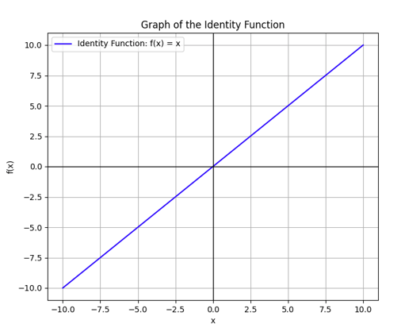

# Activation Functions

The activation function is a key mathematical function used in neural networks to decide if a neuron should be activated or not. It takes the weighted sum of the neuron’s inputs, processes them, and calculates a new value that determines how much signal gets passed on to the next layer in the network. In simpler terms, it controls how strongly a neuron reacts to the input values.

This function is essential for training neural networks because it helps the network model complex, non-linear relationships. Choosing the right activation function for the network architecture and the specific data can greatly impact the performance and outcomes of the model, making it a critical part of building a neural network.

# Linear Activation Function

A linear function can be thought of as a basic activation function that simply multiplies the input by a constant 
c, such as 𝑐×𝑥. When c=1, it becomes the identity function. However, this linear function doesn’t introduce any non-linearity to the neural network.

# Non-Linear Activation Function

Non-linearity is essential in neural networks because, without it, even networks with multiple layers would only produce linear outputs, no matter how many layers are added. Since most real-world data is not linearly separable, adding non-linear layers helps transform the data in a way that allows the network to learn more complex patterns and use various objective functions effectively.

Now if you look into the above plot,you can see that there is no way you can seperate two classes A & B using a straight line.In other words this data is not linearly seperable.
That is exactly where activation functions comes into play.
There are two main properties for an activation function in a neural network:

1.Non-linearity (discussed above)

2.Differentiable

For a neural network to learn, its activation functions must be differentiable. 
This means that the function must have a derivative, which allows us to calculate 
how much the function's output changes in response to small changes in the input. 
This is important because the neural network learns through a process called 
backpropagation, where the network adjusts its internal settings like the weights 
to improve predictions.

Here's how it works in simple terms: During training, the network makes a prediction, 
then compares it to the actual result. The difference (or error) is used to 
adjust the weights. To figure out how to adjust them, we calculate the gradient 
(the derivative) of the activation function, which tells us how sensitive the output 
is to changes in the input.

Let’s say we have a very simple network with just one neuron and use the sigmoid 
activation function:

   σ(x) = 1 / (1 + e^(-x))

For example, if the input x = 2, then:

    σ(2) = 1 / (1 + e^(-2)) ≈ 0.88
    
Now, we need to know how to adjust the weights based on the error. For that, we 
need the derivative of the sigmoid function:

    σ'(x) = σ(x)(1 - σ(x))

For x = 2, this gives:

    σ'(2) = 0.88 * (1 - 0.88) ≈ 0.105

This derivative tells us how much the output changes if we tweak the input slightly. 
During backpropagation, we use this information to adjust the weights to improve the 
prediction, and by repeating this process, the network learns over time.

In short, the differentiability of the activation function allows the neural network 
to adjust its weights and improve its predictions step by step.

#
Activation functions have many advantages, but they can also have challenges during training. Some activation functions, like Sigmoid or Tanh, have areas where their gradients become very small, often approaching zero. These areas are called saturation regions. In these regions, small changes in the input values cause very tiny changes in the output of the activation function. As a result, the training process slows down significantly. This is known as the vanishing gradient problem.

For example, consider the Sigmoid activation function:

    σ(x) = 1 / (1 + e^(-x))

When the input value is very large or very small (in the range where the sigmoid function approaches its maximum or minimum), the gradient (or derivative) becomes almost zero. For instance:

    For x = 10, σ(10) ≈ 0.99995 (close to 1)
    The derivative σ'(x) ≈ 0.00005 (a very small value)

Now, if we want to adjust the weights based on this small gradient, the update becomes extremely small. This means the network learns very slowly in these regions, leading to slower convergence during training.

This issue is known as the Vanishing Gradient Problem. It occurs when the gradients (derivatives) of activation functions become very small, particularly in regions where the activation function is saturated (e.g., near the maximum or minimum values of the Sigmoid or Tanh functions). This leads to very small weight updates during backpropagation, slowing down or even halting the learning process in deep neural networks.
In simpler terms, when the values of the input push the activation function to its extremes (near the max or min), the function doesn't change much anymore. This slow response can hinder the learning process, making it harder for the network to adjust and improve.

# Logistic Sigmoid & Tanh Activation Function

In the early days of neural networks, two common activation functions (AFs) used to introduce non-linearity were the **Logistic Sigmoid** and **Tanh** functions. These functions were inspired by the firing of biological neurons in the human brain.

#### Logistic Sigmoid Function:
The **Logistic Sigmoid** is a very popular and traditional activation function. It's mathematically defined as:

Logistic Sigmoid(x) = 1 / (1 + e^(-x))

This function takes an input `x` and squashes it into a range between 0 and 1. So, no matter how large or small the input is, the output will always stay between 0 and 1.

This squashing effect helps neural networks model complex patterns in the data, but it comes with the problem vanishing gradient problem.

#### Tanh Function

To address the vanishing gradient problem and other issues with the Logistic Sigmoid, the **Tanh** (hyperbolic tangent) function is often used. The Tanh function has a similar shape to the sigmoid but has a key difference: its output is zero-centered. This means that the output values range from -1 to 1, instead of 0 to 1.

The Tanh function is given by:

Tanh(x) = (e^x - e^(-x)) / (e^x + e^(-x))

It is also non-linear and squashes the input, but it has the advantage of being zero-centered. This makes the training process more stable and can help with convergence.

#### Zero-Centered Nature of Tanh:

The **Tanh function** is **zero-centered**, which is an important property. This means that the output values of the Tanh function range from **-1 to 1** instead of **0 to 1** like the Logistic Sigmoid. Being zero-centered has significant benefits:

1. **Helps with convergence**: When the data is zero-centered, it helps the optimization process. Neural networks rely on gradient-based optimization techniques (like stochastic gradient descent) to update the weights during training. If the output of neurons is mostly positive (like in the case of the sigmoid function), the updates to weights can lead to slow learning because the gradients will be skewed in one direction. With Tanh, the zero-centered nature ensures that the gradients can flow more evenly, making learning more stable and faster.
   
2. **Reduces bias**: The zero-centered nature of Tanh also means that the activations can be negative, which provides more flexibility to the model. It helps the network explore a broader set of possibilities instead of being restricted to positive outputs.

##### Example:
Let's say `x = 2`:

Tanh(2) = (e^2 - e^(-2)) / (e^2 + e^(-2)) ≈ 0.96  (This values is in between -1 and 1)

#### Why Zero-Centered Is Helpful:
Consider what happens when the inputs to the neurons are large positive or large negative values. For the **Logistic Sigmoid** function, if the input is large positive, the output will approach 1, and if the input is large negative, the output will approach 0. This creates an issue because during backpropagation, the gradient of the sigmoid function near its saturation points (near 0 or 1) becomes very small. This means the network's learning will slow down because the weights won't get updated effectively.

Both sigmoid and tanh can suffer from the vanishing gradient problem in deep networks, where gradients become very small and stop the weights from updating effectively. However, tanh is generally preferred because it has a wider range of gradient values (compared to sigmoid), making it more effective in practice for learning over longer time periods and deeper networks.

Both sigmoid and tanh can suffer from the vanishing gradient problem in deep networks, where gradients become very small and stop the weights from updating effectively. However, tanh is generally preferred because it has a wider range of gradient values (compared to sigmoid), making it more effective in practice for learning over longer time periods and deeper networks.

### Why tanh isn't directly used for probabilities?

Sigmoid is specifically designed for probability-like outputs because it maps any input to a value between 0 and 1. This is why it's typically used in binary classification tasks where the output represents a probability of class membership.

Tanh actually maps input to values between -1 and 1. This makes it more suited for tasks where the output needs to be centered around zero, such as in regression problems or hidden layers of neural networks. Tanh's range allows for both positive and negative activations, which can be beneficial in modeling complex relationships in data.

Lets assume a network with 1 input layer,1 hidden layer with Tanh activation function and 1 output layer with sigmoid activation function.

**What does the Hidden layer do?**:

The **tanh** activation function maps the input to values between **-1 and 1**. This helps the network learn both positive and negative features, making it better at capturing complex relationships in the data or in other words
the hidden layer transforms the input in a way that the network can learn from both positive and negative patterns.

**Output Layer with sigmoid**:

The **sigmoid** activation function maps the output to values between **0 and 1**, making it perfect for situations where you want the output to represent a **probability** and can be used for
for binary classification tasks.

Let’s say we have a simple neural network with:
- **Input value** = 0.5
- **Weight between input and hidden layer** = 2
- **Bias for hidden layer** = 0.1
- **Weight between hidden layer and output layer** = -1.5
- **Bias for output layer** = 0.2

### Hidden Layer Calculation (Using tanh):

First, we will calculate the input to the hidden neuron by multiplying the input by the weight and adding the bias:

z1 = (w1 * x) + b1 = (2 * 0.5) + 0.1 = 1.0 + 0.1 = 1.1

Now, we apply the tanh function to this value:

hidden_output = tanh(1.1) ≈ 0.7616

So, the output of the hidden layer is 0.7616.

### Output Layer Calculation (Using sigmoid):

Now, we take the output of the hidden layer (which is 0.7616) and pass it through the output layer. First, we calculate the input to the output neuron:

z2 = (w2 * hidden_output) + b2 = (-1.5 * 0.7616) + 0.2 = -1.1424 + 0.2 = -0.9424

Finally, we apply the sigmoid function to this value:

output = 1 / (1 + e^(-z2)) = 1 / (1 + e^(0.9424)) ≈ 1 / (1 + 2.567) ≈ 0.279

The final output (after applying sigmoid) is approximately 0.279. This means that the model predicts a 27.9% chance that the input belongs to class 1 (or class 0).

### How can tanh be used in the output layer if it's bound to -1 and 1?

We typically wouldn't use tanh in the output layer for most real-world problems where the output needs to be either an unrestricted continuous value or a probability. This is because tanh is bounded between -1 and 1, which limits its applicability, especially in cases like regression tasks or classification tasks that require output values beyond that range, such as probabilities between 0 and 1.

# ReLU (Rectified Linear Unit)

ReLU is probably the most commonly used activation function in neural networks. It's popular for a good reason—it’s simple, computationally efficient, and works well in most cases. 

The ReLU function is defined as:

ReLU(x) = max(0, x)

In simpler terms, ReLU takes the input `x` and outputs:
- The value of `x` if `x` is greater than or equal to 0.
- Zero if `x` is less than 0.

### How Does ReLU Work?

Let’s break it down with an example. Suppose you pass two different inputs to the ReLU function: one positive and one negative.

- For an input `x = -2`, the output of ReLU would be:

ReLU(-2) = max(0, -2) = 0

- For an input `x = 3`, the output of ReLU would be:

ReLU(3) = max(0, 3) = 3

You can see how ReLU "zeros out" negative values. This makes it an effective way to introduce non-linearity into a neural network without losing too much information for positive inputs.

When the input is negative, ReLU outputs zero and the gradient is zero as well. As a result, the neuron doesn’t learn during backpropagation, and the network can fail to train properly. This is often called the **dying ReLU problem or Dying Neurons**.

### Leaky ReLU

To address the issues with ReLU, particularly the dying neuron problem, **Leaky ReLU** was introduced. Leaky ReLU is a variation of ReLU that allows a small, non-zero gradient for negative inputs. This ensures that neurons can still learn, even when the input is negative. The Leaky ReLU function is defined as:

**LeakyReLU(x) = x, if x ≥ 0**  
**LeakyReLU(x) = 0.01 * x, if x < 0**

In other words:
- If `x ≥ 0`, then `LeakyReLU(x) = x`
- If `x < 0`, then `LeakyReLU(x) = 0.01 * x`

Let’s use an example again. If we pass the same inputs as before to Leaky ReLU:

- For an input `x = -2`:  
  `LeakyReLU(-2) = 0.01 * (-2) = -0.02`

- For an input `x = 3`:  
  `LeakyReLU(3) = 3` (since the input is greater than or equal to 0)

Notice that instead of turning negative inputs into zero, Leaky ReLU gives them a small negative slope, which means the neuron can still "learn" from negative values. This prevents the "dying" neurons that we see with ReLU.

Leaky ReLU avoids the problem of dead neurons by allowing small negative values to pass through the network and ensures that neurons keep updating during training.
Since negative values still have a small gradient, the network can converge faster, avoiding the issues that ReLU might face in certain situations.

One of the main limitations of **Leaky ReLU** is that the small slope it uses for negative values — like `0.01` or `0.02` — is manually chosen. This slope is fixed and does not change or adapt during training. The issue with this approach is that the same constant slope might not be suitable for every dataset or task. But since Leaky ReLU does not have the ability to adjust this slope automatically, it can limit the model’s flexibility and learning capability in certain situations.

### Parametric ReLU (PReLU)

#### What is PReLU?

Parametric ReLU (PReLU) is an improvement over Leaky ReLU, introduced to solve the issue of choosing a fixed slope (α) for the negative part of the function in Leaky ReLU.

Instead of using a predefined constant value (like 0.01), PReLU makes the slope a learnable parameter, allowing the network to find the best value during training for better performance.

#### PReLU Activation Function Formula:

PReLU(x) = x         if x ≥ 0  
          p * x      if x < 0

Here, `p` is a trainable parameter, not a constant like in Leaky ReLU.  
This means the model learns the most suitable slope `p` for the negative region during training.  
The output range of PReLU is (-∞, ∞).

In Leaky ReLU, the slope (e.g., 0.01) is constant and may not be optimal for every dataset or task.  
PReLU adapts by learning the best slope `p` based on training data.  
This makes it more flexible and expressive than ReLU or Leaky ReLU.

However, since the model learns one more parameter (the slope), it can lead to overfitting if not regularized properly.

Let’s take an example to understand how PReLU works:

- Input `x = -3`  
- Trainable parameter `p = 0.2`

Now, apply the PReLU formula:

Since `x < 0`,  
PReLU(x) = p * x = 0.2 * (-3) = -0.6

So, the output of PReLU for input `-3` is `-0.6`.

If the input was `x = 4`, then:  
PReLU(x) = 4 (since x is positive, it behaves just like ReLU)

One of the key advantages of PReLU is that it learns from data and adapts better to the specific problem during training.It also helps prevent dead neurons, a common issue with the standard ReLU function.  
Additionally, it is more powerful than Leaky ReLU because the slope for negative inputs is a trainable parameter rather than a fixed constant.
Apart from these advantages,PReLU has issues like higher risk of overfitting (as it introduces additional trainable parameters into the model).  
It is also slightly more complex to train compared to ReLU or Leaky ReLU, due to the need to learn the slope for the negative part of the function.

### How PReLU (Parametric ReLU) Learns the Parameter `p`

In **PReLU (Parametric ReLU)**, the main difference is that the slope for negative inputs, represented by `p`, is a **learnable parameter**. This allows the model to adjust this slope during training to improve its performance based on the data it's seeing, unlike other functions like **ReLU** or **Leaky ReLU** where the slope is fixed.

Initially, the slope parameter `p` starts with a small positive value, typically around **0.25**. This initial value doesn’t have to be perfect; the key is that it will get fine-tuned during training.

When forward propagation occurs, the **PReLU** activation function works like this: If the input is positive, the output is simply the same as the input, just like ReLU. But if the input is negative, the output becomes `p * x`, where `x` is the input and `p` is the current value of the slope parameter.

After the forward pass, the model calculates the **loss**, which represents how far off the predictions are from the actual target values. This loss is calculated using a function like **Mean Squared Error (MSE)** or **Cross-Entropy Loss**.

Then, the magic happens during **backpropagation**. This process helps adjust the weights, biases, and the slope parameter `p` to minimize the loss. Specifically, the derivative of the loss is calculated with respect to `p`, the slope.

For the PReLU function, the derivative works like this: if the input is positive, the derivative is 1 (same as ReLU). But if the input is negative, the derivative is equal to the input value `x`, because the function behaves like `p * x`.

Once the gradients are calculated, the model updates the parameter `p` using an optimization technique like **gradient descent**. Essentially, `p` is adjusted by subtracting the gradient of the loss with respect to `p`, scaled by a **learning rate**. This update rule looks like:

p = p - learning_rate * (dL/dp)

Where:
- `dL/dp` is the gradient of the loss with respect to `p`
- `learning_rate` controls the size of the adjustment

Over several training iterations (or epochs), `p` gradually learns to adapt to the data, making the model more flexible. Unlike **Leaky ReLU**, where `p` is fixed, **PReLU** allows the model to dynamically adjust this parameter to improve performance.

### ELU (Exponential Linear Unit)

The **Exponential Linear Unit (ELU)** activation function is a strong alternative to ReLU due to its ability to address some of the issues that ReLU faces, such as the "dying neuron" problem. 

ELU function can be defined as:

- **For x ≥ 0**, ELU(x) = x
- **For x < 0**, ELU(x) = α * (exp(x) - 1)

Where:
- x is the input value
- α is a constant (usually values like 1)

Unlike ReLU, which abruptly outputs 0 for negative inputs, ELU smoothly transitions to negative values, which helps the network perform better, especially for complex tasks.Since the ELU function allows negative values (with a curve shaped by `α`), it avoids the problem of "dying" neurons which ReLU suffers from, where neurons stop learning because their output is always zero for negative inputs.

Let’s take an example to understand how ELU works.

Assume:
- Input `x = -1.5`
- `α = 1`

For the input `x = -1.5`, since `x < 0`,

ELU(x) = α * (exp(x) - 1) ELU(-1.5) = 1 * (exp(-1.5) - 1)

Now, calculating `exp(-1.5)`:

exp(-1.5) ≈ 0.2231 ELU(-1.5) = 0.2231 - 1 = -0.7769

So, the output for `x = -1.5` is approximately `-0.7769`.

Since the ELU function involves an exponential calculation, it increases computational time compared to ReLU.Also, the parameter α is fixed, so there is no learning or adaptation of it during training.

ELU can cause problems with exploding gradients if the values of α and the inputs grow large.

### Swish Activation Function

**Swish** is a relatively newer activation function introduced by researchers at Google.

The function is as follows:

**Swish(x) = x / (1 + exp(-x))**

This function is a smooth, non-monotonic function that combines elements of the sigmoid function with a linear identity function. Swish has been found to outperform ReLU and other common activation functions in many deep learning models.

Unlike ReLU, which has a sharp transition at zero, Swish is smooth across its entire range, which can help the network learn more effectively
and also Swish is non-monotonic, meaning it can have both positive and negative slopes at different points, which gives the network more flexibility in learning complex patterns.
Swish has shown improved performance in various deep learning tasks, such as image classification and natural language processing, compared to ReLU and other traditional activation functions.

Let’s go through an example

- Input `x = -2`
- We will use the formula for Swish: `Swish(x) = x / (1 + exp(-x))`

Now, calculate Swish for `x = -2`:

Swish(-2) = -2 / (1 + exp(-(-2))) Swish(-2) = -2 / (1 + exp(2)) Swish(-2) = -2 / (1 + 7.389) Swish(-2) = -2 / 8.389 Swish(-2) ≈ -0.238

So, when input `x = -2`  output is approximately `-0.238`.

Since Swish involves a sigmoid function, it is computationally more expensive than ReLU, which is a simple thresholding function.

# Softmax Function

The **Softmax function** is commonly used in the final layer of a neural network for **multi-class classification** problems. Its primary purpose is to transform raw output scores (**logits**) from a neural network into a **probability distribution** over multiple classes.

### How Softmax Works

Softmax converts a vector of raw scores into probabilities, where each probability indicates the likelihood of a specific class. These probabilities lie in the range `(0, 1)` and the sum of all probabilities equals `1`. This makes it ideal for classification tasks, where the goal is to assign an instance to one of several classes.

Softmax function :

S(z_i) = e^(z_i) / ∑ e^(z_j)

Where:
- `z_i` is the raw output score (logit) for class `i`.
- `e^(z_i)` is the exponentiation of the raw score for class `i`.
- `∑ e^(z_j)` is the sum of the exponentiated values for all classes `j` in the output layer.
- `S(z_i)` represents the normalized probability for class `i`.

### Example Calculation (Image Classification)

Imagine a neural network outputs the following logits for a 3-class image classification problem (e.g., identifying 'cat', 'dog', or 'rabbit'):

Logits = [2.0, 1.0, 0.5]

First we will exponentiate each of the raw scores using the constant `e`:

Exp(Logits) = [e^2.0, e^1.0, e^0.5] ≈ [7.389, 2.718, 1.649]

Now, sum all the exponentiated values:

Sum = 7.389 + 2.718 + 1.649 ≈ 11.756

Now, for each class, divide the exponentiated value by the sum to get the probability:

P(cat) = e^2.0 / Sum ≈ 7.389 / 11.756 ≈ 0.629 P(dog) = e^1.0 / Sum ≈ 2.718 / 11.756 ≈ 0.231 P(rabbit) = e^0.5 / Sum ≈ 1.649 / 11.756 ≈ 0.140

The resulting probabilities are as follows:

Probabilities = [0.629, 0.231, 0.140]

What it means is that the network predicts that the image is most likely a **cat** with a probability of **0.629** and the second-highest probability is for a **dog** with a probability of **0.231**.

The softmax function ensures that all the output probabilities lie between `0` and `1` and the sum of all output probabilities is always equal to `1`, ensuring they form a valid probability distribution.

# Let's Sum Things Up!

## 1. ReLU Activation Function in Hidden Layers
- **ReLU (Rectified Linear Unit)** is widely used in the **hidden layers** of deep neural networks, particularly in architectures like **Convolutional Neural Networks (CNNs)** and **Fully Connected Networks (FCNs)**. 
- ReLU helps avoid the **vanishing gradient problem**, where gradients become very small during training, making learning slow and inefficient.
- It allows for faster training and helps with convergence due to its simplicity and non-linearity.

## 2. Sigmoid and Tanh in Hidden Layers
- **Sigmoid** and **Tanh** activation functions are typically avoided in **deep hidden layers** due to their susceptibility to the **vanishing gradient problem**.
- **Sigmoid** squashes its input to a small range between 0 and 1, which makes it prone to vanishing gradients as the network depth increases.
- **Tanh** has a wider range (-1 to 1) compared to Sigmoid but still suffers from vanishing gradients in deep networks.

## 3. Swish Activation Function in Deep Networks
- The **Swish function** has been proposed as an alternative to ReLU, particularly for very deep networks (networks with more than 40 layers).
- Swish is smoother and does not saturate like Sigmoid, which helps improve training stability in deeper models.

## 4. Activation Functions for Output Layer

### Regression
- For **regression** problems, where the goal is to predict a continuous value, a **linear activation function** is used in the output layer.
- A linear activation does not constrain the output range, allowing it to predict any real-valued number.

### Binary Classification
- For **binary classification** (e.g., predicting one of two classes), the **Sigmoid** activation function is commonly used in the output layer.
- Sigmoid outputs a value between 0 and 1, representing the probability of the input belonging to one of the classes.

### Multiclass Classification
- For **multiclass classification** (e.g., classifying an input into one of several classes), **Softmax** is used in the output layer.
- Softmax converts the raw logits into a probability distribution, ensuring that the sum of all output probabilities equals 1.

### Multilabel Classification
- For **multilabel classification** (where each input can belong to multiple classes), **Sigmoid** is used for each class in the output layer.
- Each Sigmoid unit independently predicts the probability that a particular class label is present.

## 5. Activation Functions for Specific Neural Network Architectures

### Convolutional Neural Network (CNN)
- **ReLU** is commonly used in the hidden layers of CNNs. It allows the network to learn complex spatial patterns and speeds up training by avoiding issues related to gradient saturation, unlike Sigmoid or Tanh.

### Recurrent Neural Network (RNN)
- In **RNNs**, **Tanh** and **Sigmoid** are often used for the hidden layer activations. These activation functions help the network handle temporal data and learn long-term dependencies.
- **LSTMs (Long Short-Term Memory)** and **GRUs (Gated Recurrent Units)**, which are specialized RNNs, also rely on **Tanh** and **Sigmoid** to mitigate the vanishing gradient problem in sequence learning tasks.

- **ReLU** is generally used in the **hidden layers** of most deep networks like CNNs and FCNs.
- **Sigmoid** and **Tanh** are avoided in deep hidden layers due to the **vanishing gradient problem**.
- **Swish** can be used in very **deep networks** to improve training stability.
- The **output layer activation function** depends on the problem:
- **Linear** for regression.
- **Sigmoid** for binary classification and multilabel classification.
- **Softmax** for multiclass classification.
- The choice of activation function in **hidden layers** is architecture-dependent, with **ReLU** preferred for CNNs and **Tanh/Sigmoid** used in RNNs.

By choosing the right activation functions for the layers and network architecture, we can greatly improve the performance and efficiency of your neural network models

