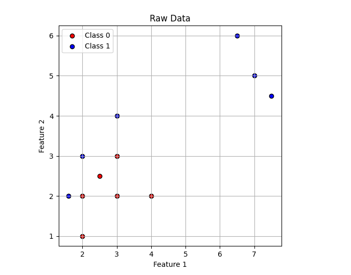

# Activation Functions

The activation function is a key mathematical function used in neural networks to decide if a neuron should be activated or not. It takes the weighted sum of the neuron’s inputs, processes them, and calculates a new value that determines how much signal gets passed on to the next layer in the network. In simpler terms, it controls how strongly a neuron reacts to the input values.

This function is essential for training neural networks because it helps the network model complex, non-linear relationships. Choosing the right activation function for the network architecture and the specific data can greatly impact the performance and outcomes of the model, making it a critical part of building a neural network.

A linear function can be thought of as a basic activation function that simply multiplies the input by a constant 
c, such as 𝑐×𝑥. When c=1, it becomes the identity function. However, this linear function doesn’t introduce any non-linearity to the neural network.

Non-linearity is essential in neural networks because, without it, even networks with multiple layers would only produce linear outputs, no matter how many layers are added. Since most real-world data is not linearly separable, adding non-linear layers helps transform the data in a way that allows the network to learn more complex patterns and use various objective functions effectively.

Now if you look into the above plot,you can see that there is no way you can seperate two classes A & B using a straight line.In other words this data is not linearly seperable.
That is exactly where activation functions comes into play.
There are two main properties for an activation function:

1.Non-linearity (discussed this above)
2.Differentiable

For a neural network to learn, its activation functions must be differentiable. 
This means that the function must have a derivative, which allows us to calculate 
how much the function's output changes in response to small changes in the input. 
This is important because the neural network learns through a process called 
backpropagation, where the network adjusts its internal settings (like the weights 
of neurons) to improve predictions.

Here's how it works in simple terms: During training, the network makes a prediction, 
then compares it to the actual result. The difference (called the error) is used to 
adjust the weights. To figure out how to adjust them, we calculate the gradient 
(the derivative) of the activation function, which tells us how sensitive the output 
is to changes in the input.

Simple Example:

Let’s say we have a very simple network with just one neuron and use the sigmoid 
activation function:

   σ(x) = 1 / (1 + e^(-x))

For example, if the input x = 2, then:

    σ(2) = 1 / (1 + e^(-2)) ≈ 0.88
    
Now, we need to know how to adjust the weights based on the error. For that, we 
need the derivative of the sigmoid function:

    σ'(x) = σ(x)(1 - σ(x))

For x = 2, this gives:

    σ'(2) = 0.88 * (1 - 0.88) ≈ 0.105

This derivative tells us how much the output changes if we tweak the input slightly. 
During backpropagation, we use this information to adjust the weights to improve the 
prediction, and by repeating this process, the network learns over time.

In short, the differentiability of the activation function allows the neural network 
to adjust its weights and improve its predictions step by step.
